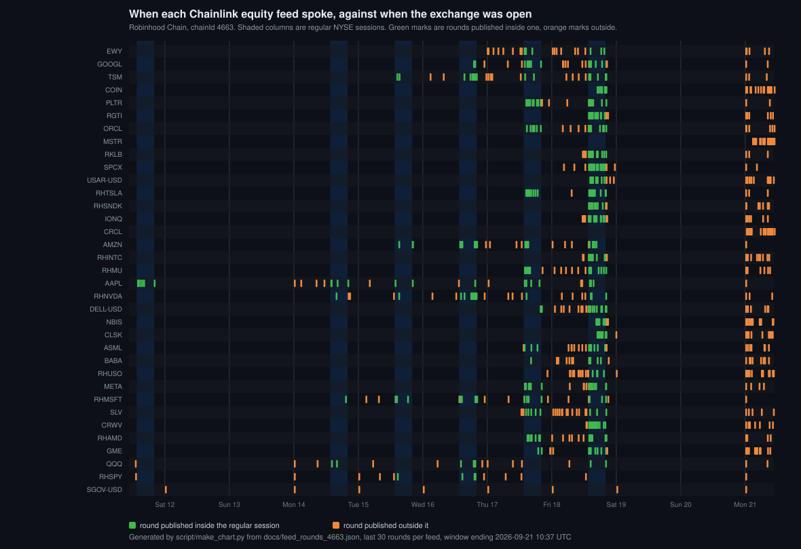

# Bell

**The exchange has an opening bell. The onchain market for its shares does not.**

Bell is one call on Robinhood Chain mainnet that a contract makes before acting on a Chainlink stock price.
It answers ALLOW, WAIT or REJECT, with the reason, for any of the 35 equity feeds.



Thirty-five Chainlink equity feeds on Robinhood Chain, ten days. The shaded columns are the regular NYSE
sessions. **1,003 rounds published, 509 of them outside those columns**, and the rate is different for every
row: `RHTSLA / USD` publishes 4 rounds in 30 out of session, `Robinhood MSTR / USD` publishes 30 in 30.

The obvious claim would be that the out-of-hours price is worse, so I measured it on
**968,799 swaps and $409M of USDG volume** across the 58 tokenized-equity pools on this chain. It is not
materially worse: the median gap between the pool's own price and the feed is 0.168 % during the session, 0.162 % at
night and 0.063 % at weekends. The measurement is in this repo.

**So the defect is not accuracy, it is that the number does not say which market it came from.** A feed
answers `latestRoundData()` at 03:00 on a Sunday with a real, roughly right number, often more than a day old, and nothing in
the response distinguishes it from a regular-session price. `updatedAt` gives the age of the onchain round
([Chainlink API reference](https://docs.chain.link/data-feeds/api-reference)), not the session it belongs to
and not the time of the market observation behind it.

That gap already sits under live contracts. In the one live stock market I found on this chain (as of 2026-09-21), **28 of 30 settlements read the
same feed round on both sides** (93.3 %, 95 % Wilson interval 78.7 % to 98.2 %), so a tie-break rule decided
them rather than any price movement. The market's author found this first in their own audit and fixed the
tie rule on 2026-09-22; see [`docs/REPLAY.md`](docs/REPLAY.md). On Morpho, 735,891 of the 1,623,948 USDG ever
borrowed against stock tokens here was opened while NYSE was shut, 304,053 of it on a price older than the
feed's own 24 hour heartbeat, and nothing in those markets records which
([below](#who-borrows-against-stocks-here-and-on-which-price); no loss followed, and that is said there too).
Bell is the layer that answers the session question, attaches the age to it, and refuses when the pair is
not fit to act on.

> Buildathon work (Arbitrum Open House Singapore, 14 Sept to 4 Oct 2026), solo, unaudited.
> Everything below is live on chainId 4663 and meant to be checked rather than believed.
> Nobody outside this repo uses it yet, which is said again in its own section rather than buried here.

## What to look at, in order

| If you have | Read |
|---|---|
| 60 seconds | the chart above, then the addresses below |
| 5 minutes | this file |
| an hour | [`docs/DETAILS.md`](docs/DETAILS.md), the long version of everything here |
| a grudge | [`docs/THREAT_MODEL.md`](docs/THREAT_MODEL.md), where one attack works |
| a contract to fix | [`docs/INTEGRATION.md`](docs/INTEGRATION.md): the interface, the gas, and what to do with each answer |
| another session project open in the next tab | [where this sits among them](#where-this-sits-among-the-other-session-projects), with the line of their code that decides each row |

**Using it is one call and one branch**, against a contract that is already deployed, stateless, unowned
and free to call:

```solidity
IPushFeedGuard constant GUARD = IPushFeedGuard(0x8aF68a9fF7583097A7476060C6B56eB33dA7a711);

(Verdict v, Reason r, int256 price,) = GUARD.check(feed, 900);
if (v != Verdict.ALLOW) revert NotNow(uint8(r));
// price is a regular-session price, no older than your 900 seconds
```

An in-session check costs **27,305 gas**, and refusing costs
**15,926** because outside the session the feed is never read. The verdict says whether to act and the
reason says why not, so you decide between waiting and refusing rather than inheriting mine.
[`docs/INTEGRATION.md`](docs/INTEGRATION.md) has the table of what each answer means.

**Nine contracts sit in `src/`, but only one is the product.** `PushFeedGuard` answers the session
question for all 35 equity feeds from one stateless deployment. `SessionCalendar` is the library inside it.
Everything else is either a consumer built to prove the guard does something (`SettleOnMark`, `SettleMini`),
a different shape of the same answer (`BellFeedAdapter` reverts instead of returning, `SettlementPairGuard`
adds the one rule a per-read check cannot express), a public record (`SessionLog`), the Data Streams half
whose session ladder has not resolved on a live bell yet (`Bell`), or a one-pool swap helper I wrote to buy the demo's USDG
(`MinimalSwapper`). I wrote it because the canonical `SwapRouter` address does not answer on this chain;
Uniswap's Universal Router is deployed here (`0x204FAca1764B154221e35c0d20aBb3c525710498`), which I missed
at the time.


## Sixty seconds

```bash
python script/verify.py     # no key, no wallet: reads the deployed contracts and rechecks the headline numbers
```

| Contract | Answers | Address |
|---|---|---|
| **PushFeedGuard** | is this feed's price fit to act on right now, for **all 35 equity feeds** | `0x8aF68a9fF7583097A7476060C6B56eB33dA7a711` |
| **SessionLog** | a public, write-once record of what the feeds said at each bell | `0xc482943C7fEE1dD7807Edad1c88260E4263fD0Ad` |
| **Bell** | session status and a session reference price from DON-signed Data Streams reports, with a receipt | `0x88a5a0414c9fd615201814ddbec4e4d9e4d283d0` |
| **BellFeedAdapter** | the same Chainlink signature, but it reverts instead of returning an inadmissible price | `0x4F0331DDbdDfE3349e16e37F80219A868B876655` |
| **SettleOnMark** | the MSTR trade: settled on a recorded closing mark on 2026-09-22, 0.40 USDG paid | `0x484720AA05BcF183d80B6c2747163f47501aeae9` |
| **SettleOnMark** | the AAPL trade: its mark missed the bell, so it refunds instead of paying | `0x52a0E0d3BD4729BCD622fed437EDb428835658Ac` |

**What is proven today, on mainnet:**

- **a real USDG trade settled on a recorded closing mark.** On 2026-09-22 a keeper wrote the MSTR closing mark
  inside the trade's window at 19:58:05 UTC (verdict ALLOW, price 167.82, 836 s old, inside the 900 s budget;
  [mark tx](https://robinhoodchain.blockscout.com/tx/0xf2578581097af3034493e537eada0d61b1950e5213d06d95e681082e588cfecb)),
  and the trade settled against its 168.00 strike, paying the short side 0.40 USDG
  ([settle tx](https://robinhoodchain.blockscout.com/tx/0x14a56c4dca329c80b1363b21db99c981c3b8430b2ba3993c3c5b3f002e744def)).
  The stakes are 0.20 USDG a side: this proves the path, not a market.

- the guard answers for all 35 Chainlink equity feeds from one stateless deployment, with the reason
  attached, and a run six hours before the bell returned **35 REJECT / OUTSIDE_SESSION** while every one
  of those feeds was happily serving a price ([full output](docs/session_report_2026-09-21T0714Z.txt));
- Bell verified two **real DON-signed reports** through the official Chainlink verifier, wrote receipts,
  and then refused to serve them: `checkLive` answers `WAIT / OBS_STALE`. A valid signature is not
  permission;
- the audit in [`docs/REPLAY.md`](docs/REPLAY.md) shows what the absence of this layer already permits:
  of 30 settlements on that market, **28 read the same feed round on both sides**,
  so a tie-break rule decided them rather than any price movement. The same section attacks its own
  sample: 23 of those 30 were locked and settled within a minute of each other, which looks like an
  operator testing rather than a market trading; the 11.9 hour median price age is an out-of-session
  number, while the two fully in-session cases were 4 and 8 minutes old; and 26 of the 30 markets had no
  bet at all, with 0.009 ETH ever staked across all of them. What survives: a deployed contract on this
  chain can settle a stock market on a price from a day the exchange never opened, and nothing in the
  data it reads can tell it so.

## I tested the price story and lost

The obvious way to put a number on this problem is to show that the feed is further from the market when
the exchange is shut. I measured exactly that, and it is not true.

`script/price_gap.py` takes each swap's `sqrtPriceX96` as the pool's own mid, finds the Chainlink round a
contract would have read at that same moment, and splits the gap by session state. Over one week and
968,799 swaps ([`docs/price_gap_4663.json`](docs/price_gap_4663.json)):

| | swaps | USDG volume | median gap | p90 | p99 |
|---|---:|---:|---:|---:|---:|
| regular session | 259,946 | $176,805,400 | **0.168 %** | 0.427 % | 1.085 % |
| weekday nights | 503,407 | $169,844,903 | **0.162 %** | 0.380 % | 0.696 % |
| weekends | 205,446 | $62,212,328 | **0.063 %** | 0.479 % | 0.802 % |

The out-of-session price is not a worse price, and the weekend median is the smallest of the three.
Arbitrage does its job.

Three controls, because a negative result is only worth something if it survives the objections that would
have been raised against a positive one:

- **Dollars, not a stablecoin.** The pool quotes shares in USDG and the feed quotes them in USD, so the
  USDG/USD feed is applied rather than assumed. Its range is 1.31 basis points over the week.
- **The price before the swap.** `sqrtPriceX96` in a Swap event is the price *after* the trade, so it
  carries that trade's own impact. Reconstructing the pre-trade price (`d(sqrtP) = dy / L`, exact within a
  tick) gives 0.154 % in session, 0.177 % at night, 0.085 % at weekends. On this measure weeknights are
  somewhat wider than the session and weekends narrower: nothing like the large out-of-hours gap the
  hypothesis needed.
- **Direction.** Buying the share and selling it come out at **+0.041 % and +0.030 %** in session
  (n = 130,091 and 129,855), +0.079 % and +0.085 % at night. Same sign either way, so this is a level, not a
  one-sided flow artefact.

Two more objections, both measured rather than waved away, on a shorter three-day window so the sensitivity
question does not disturb the headline sample ([`docs/price_gap_sensitivity_3d.json`](docs/price_gap_sensitivity_3d.json)):

- **Does the effect live in the minutes around the bell?** Removing every swap within five minutes of an
  opening or closing bell leaves the ordering unchanged: 0.215 % in session, 0.188 % at night, 0.063 % at
  weekends. It is not a boundary artefact. Note the sample: three days contain one full session, so the
  in-session cell there rests on 7,979 swaps and is the weakest number on this page.
- **Could a feed round written later in the same block have been invisible to the swap?** Blocks here are
  0.1 s and feeds publish hours apart, so this counts rather than assumes: across the three-day sample,
  **180 swaps share a second with a feed round** (77 in session, 103 at night, 0 at weekends), out of
  roughly 360,000. That is 0.05 % of the sample and cannot move a median.

And the strongest boring explanation, removed rather than argued with: a threshold feed lags because it has
not crossed its 0.5 % trigger yet. Conditioning on rounds published within the last five minutes, so the
feed has just spoken, leaves 0.174 % in session against **0.124 % at night** (n = 46,620 and 32,414). Still
smaller outside. The weekend cell contains zero swaps, which is its own finding: **on a weekend the feed is
never fresh.**

**So the defect this project addresses is not accuracy.** The number a contract reads out of hours is real,
recent and roughly right. It simply belongs to a different market than the one the contract promised its
users, and nothing in `latestRoundData()` says which. That is a semantic defect, and the audit in
[`docs/REPLAY.md`](docs/REPLAY.md) is what it costs: 28 of 30 settlements decided by a tie rule because both
snapshots read one round.

## Who borrows against stocks here, and on which price

The same question asked of someone else's live money. `script/morpho_session_replay.py` reads every
`Borrow`, `Repay` and `Liquidate` ever emitted by a Morpho Blue market on this chain whose collateral is a
genuine stock token (110 markets, bytecode-checked, not symbol-matched) and labels each loan with the
session it was opened in and the age of the price the market's oracle was reading at that moment.

| From 2026-07-02 to 2026-09-29 | |
|---|---|
| Loans against stock tokens | **308** in 39 markets, **1,623,948** USDG in total |
| Opened while NYSE was shut | **735,891** USDG (45.3 %): weeknights 22.3 %, weekends 23.0 % |
| Opened on a price older than the feed's own 24 hour heartbeat | **304,053** USDG in 38 loans by 18 borrowers, all at weekends |
| Median age of the price at the moment of the loan | 3.52 h, maximum 69.94 h |
| Liquidations | 3, repaying 27.34 USDG in total, **no bad debt** |
| Outstanding today (Morpho's API) | $675,040 against $1,716,018 of collateral |

The largest single example: on Sunday 2026-09-27 at 04:57 UTC one transaction
([`0x8a1335c0…5108`](https://robinhoodchain.blockscout.com/tx/0x8a1335c0241351f740dd458cac201eb25409303b67f5cc90c00c48f2d6645108))
borrowed 300,000 USDG against AAPL, NVDA and SPCX, priced by rounds printed on Friday evening, 33.0 to 33.4
hours earlier. The three markets' oracles do read those feeds: each one's `price()` equals the feed's answer
times the token's `uiMultiplier()` divided by the USDG/USD price, to ten significant digits (cast, 2026-09-29).
AfterHours Oracle spotted the same Sunday transaction independently and cites it in its own submission
(`status/morpho-2026-09-30.txt` in its repo, which also marks each of its 113 borrows since 2026-09-16 as in or
out of the regular session by a weekday clock); what this replay adds is all 308 loans since the markets opened,
the exact NYSE calendar and the age of the price.

The boring explanation, which I think is the right one: nothing went wrong. One address opened 94.8 % of all
this borrowing, and the book sits at 39 % loan-to-value ($675,040 against $1,716,018 in the table) under a
62.5 % limit on the largest markets, and the price out of hours is not worse
(section above). So the table is a label, not a loss. What it shows is that nearly half of the lending
against stocks on this chain happens in hours the exchange never saw, and nothing in the markets records
it; a curator who wanted a different rule for those hours would need exactly one reading of `sessionAt`.
Coverage, stated: the 40 further markets whose collateral carries a stock ticker but no verified pool hold
no debt today ($675,040 above against $675,097 for every equity market in Morpho's API on 2026-09-28).

## I attacked it myself, and one attack worked

[`docs/THREAT_MODEL.md`](docs/THREAT_MODEL.md) lists every way a reviewer or I could find to take money
out of a trade that settles on a recorded mark, and each one is a test in
[`test/Adversarial.t.sol`](test/Adversarial.t.sol) rather than a paragraph.

| Attack | Outcome |
|---|---|
| The losing side controls the keeper and refuses to write the mark | **Fails.** The mark is permissionless, so the winner or a stranger writes it and the trade settles against the silent party. |
| Nobody writes the mark at all | **Works.** The day produces nothing and `refund()` turns a loss into a draw. Unfixable in the contract, because the alternative is inventing a price. Mitigation is operational and stated. |
| Choosing which second inside the window becomes the mark | **A real lever, bounded.** 334.90 at `C-100` pays the short, 335.10 at `C-30` pays the long. `markWindow` cuts the choice from 300 seconds to the trade's budget, and both candidates stay onchain. |
| The guard refuses forever and the stakes are trapped | **Fails.** The exit never reads the oracle, tested three ways, the harshest being a trading date outside the calendar's tabulated years where no admissible mark can ever exist. |
| A submitter hides a report and publishes a better rung later | **Fails.** Rungs are fixed by the calendar, so withholding produces `UNRESOLVED`, never a higher payout. |
| An impostor token wearing a real ticker | **Filtered by lineage,** not by the symbol string, with the limit of that test stated. |

Writing these surfaced a design point worth saying out loud: `SessionLog` records with an unlimited age
budget, because the log's job is to state what the session was, while the age budget belongs to the
consumer. A mark can therefore be admissible to the log and still unusable by the trade, and both refusal
paths end in a refund rather than a lock.

**What is not proven yet, stated before anyone asks:**

- the ladder, Bell's DON-signed session reference, has never resolved on a real bell. Every signed report
  I hold is mid-session, and US equity Data Streams are not sold to a self-serve account today, so that
  half is code and tests waiting for access, not a live claim ([Limitations](#limitations-stated-up-front));
- nobody outside this repo uses any of it yet. The adapter exists so that integrating is one address
  change rather than a rewrite, but a one-line integration is still not an integration.

## What happened when I ran it for real

On 2026-09-21 a trade was funded with 2 USDG on both sides and the closing mark for AAPL was written on
chain: tx [`0x92e2ed34…acc2554`](https://robinhoodchain.blockscout.com/tx/0x92e2ed34e1f90a61ea3383abe24a99152bbcbaeb3ea8a214b4a067451acc2554), block 69,064,362, price 339.24192943.

**It did not settle,** and that is the part worth reading. `quote()` returned
`"mark taken too far from the bell"`, the stakes stayed put, and they are refundable after
2026-09-22 22:00 UTC. Two mistakes were ours: the keeper was started with the wrong day's closing
timestamp, and the mark was written at `C-296` when the trade requires `C-120`, which burned the only write
a write-once log allows.

Neither mistake changed the outcome. The AAPL feed had not published for **3.2 hours** before the close and
the trade refuses a price older than 900 seconds, so a correctly timed mark would have been refused too, for
`PriceTooOld` instead. That is threat 4 in the threat model behaving exactly as documented, on mainnet, with
real money: the contract did not invent a price, did not pay on an inadmissible one, and did not trap the
funds.

The keeper now takes one argument, the trade address, and reads the feed, the trading date, `markWindow`,
`maxPriceAge` and the bell itself from the contracts, because every number it got wrong was already on
chain. The second trade, on a feed chosen from my own measurement of which feeds actually publish
(`MSTR`, whose last 30 rounds all landed outside the session with a maximum gap of 1.4 h, against AAPL going silent for days), settled on
2026-09-22 at `0x484720AA05BcF183d80B6c2747163f47501aeae9`: that is the trade at the top of this file.


## Where this sits among the other session projects

At least ten other projects in this buildathon, or built for it on GitHub, answer part of the same question. I read
the code of the eight with public repos on 2026-09-29 and 2026-10-03 (Amen and Afterglow from their HackQuest text); the last column points at the line that decides the row, so the
table can be checked rather than believed. Encoding the calendar is not rare, and three of them (Vigil, Gapguard by rule, Nokturn) do it over a
wider range of years than mine.

| Project | On mainnet 4663 | How it knows the exchange is shut | Holidays / half-days / DST | Where to check |
|---|---|---|---|---|
| **Bell** (this repo) | yes, one guard for all 35 feeds | NYSE calendar compiled in, 2026 and 2027, `NO_SESSION` after | yes / yes / yes | `src/SessionCalendar.sol`, checked against NYSE's schedule for every day of both years |
| [Vigil](https://github.com/mdlog/vigil) | testnet 46630 | onchain NYSE calendar | holiday table 2024-2028, a guardian can add closures / yes / 2022-2030 | `src/VigilCalendar.sol` |
| [Gapguard](https://github.com/Bytethebuilder/gapguard) | yes, a Uniswap v4 hook on its own demo tokens | NYSE rules computed onchain | by rule / yes / yes | `src/MarketClock.sol` |
| [Nokturn](https://github.com/wngstnr-code/nokturn) | yes since 2026-09-29, per its README | session manager fed by a governed table | table 2020-2035 / yes / yes | `contracts/src/SessionManager.sol` |
| [AfterHours Oracle](https://github.com/bongbongcrypto/afterhours) | yes, the oracle of its own Morpho AAPL/USDG market | Monday to Friday 14:30-20:00 UTC, the part of the session common to both DST regimes | none, by design: its README says a holiday or a half day's afternoon is treated as open | `src/lib.rs:807-818`, README section "What it does not do" |
| [Custos](https://github.com/robertocarlous/Custos) | testnet 46630 | open or closed per UTC day; weekends by arithmetic, holidays pushed by a keeper | via keeper / no / no hours of the day at all | `contracts/src/MarketCalendarRegistry.sol:49-64` |
| [batpilot](https://github.com/PhiBao/batpilot) | yes, a vault and a guard | the age of the last print and a price band; no calendar | none | `contracts/src/SessionGuard.sol:40` |
| [StockGuard](https://github.com/snit292012/stockguard) | testnet 46630, fork tests against mainnet | the age of the last print; no calendar | none | `src/StockGuardOracle.sol:113` |
| Amen Protocol | yes, per its submission (a guarded beta); no public repo found | "after 4pm New York time" | not stated | its HackQuest description |
| [Stock Hours Guard](https://github.com/Evoxravenlaude/Stock-Hours-Guard) | testnet 46630, mock feeds | five sessions (regular, pre, post, overnight, closed) written by an owner-appointed keeper from Robinhood's REST API; also halts, corporate actions and sequencer health | whatever the keeper writes | `contracts/src/StockGuard.sol:19`, `:170-205` |
| Afterglow | testnet, per its submission; no public repo found | "follows the market clock", weekend premium priced by a Stylus contract | not stated | its HackQuest description |

Nokturn measures off-hours execution too (worse in the tail, per its README). What none of them does and this repo does: split the pool-to-feed gap by session ([above](#i-tested-the-price-story-and-lost)), replay someone else's live settlements
([`docs/REPLAY.md`](docs/REPLAY.md)), and label every live loan against stocks by the session it was opened in
([above](#who-borrows-against-stocks-here-and-on-which-price)), all 308 since the markets opened, on the exact
NYSE calendar. AfterHours Oracle labels its own 113 borrows since 2026-09-16 by a weekday clock, and found the
largest of those loans on its own and cites it in its submission. What some of them have and this repo does
not: a consumer of their own that holds money, AfterHours its own Morpho market and batpilot its own funded
plan, and Stylus. None of their READMEs names an outside user, and Bell has none yet.


## Deployed, in full

| | |
|---|---|
| Chain | Robinhood Chain mainnet, chainId 4663 |
| Bell deploy tx | `0xbec3cb1a8813dadf0aa52e66f87d79ecb4dd487b95413fdf2062286a6187c540`, block 68,238,358 |
| Verifier it reads | `0xcE73c8ad08CBDEaCa6078BF0627C8fe0a9a536E7` (official Chainlink Data Streams VerifierProxy) |
| Owner | none, and no upgrade path anywhere. `POLICY_VERSION` 2, `CALENDAR_VERSION` 1 |
| Escrow token | Paxos USDG `0x5fc5360D0400a0Fd4f2af552ADD042D716F1d168`, 6 decimals |
| Tests | 167 pass against a mainnet fork (`forge test --fork-url robinhood`); 156 of them need no network (`forge test`) |

Two calls that need no wallet:

```bash
cast call 0x8aF68a9fF7583097A7476060C6B56eB33dA7a711 "check(address,uint64)(uint8,uint8,int256,uint256)"   0x6B22A786bAa607d76728168703a39Ea9C99f2cD0 900 --rpc-url https://rpc.mainnet.chain.robinhood.com/
# AAPL through the guard: verdict, reason, price, updatedAt

cast call 0x88a5a0414c9fd615201814ddbec4e4d9e4d283d0 "checkLive(bytes32)(uint8,uint8)"   0x000bbd87a23775b4c11092ae9a1fc7b3393636ae1dbb9f1ef460f845c0f4cff1 --rpc-url https://rpc.mainnet.chain.robinhood.com/
# 1 3 = WAIT / OBS_STALE
```

## Limitations, stated up front

- The ladder relies on Chainlink's documented window semantics (one report per time interval). If two different signed reports ever cover the same target second, Bell records a conflict and the fixing is UNRESOLVED: a liveness failure, never a chosen price. The REST semantics of "report for timestamp T" (window containing T vs. observed at T) are to be confirmed empirically on a paid stream.
- Early-close behaviour of the DON has not been observed onchain (no equity report was verified anywhere on 2026-07-03, and the next early close is 2026-11-27); it is covered by synthetic tests only.
- One poster is a liveness risk, not a safety risk: a missed rung ends in UNRESOLVED, never in a wrong price. Say the sharper version of that out loud: a poster who also holds a position cannot move the price, but can still *decline to resolve* a fixing that is about to go against them, and a deliberate silence looks exactly like a crashed poster. The structural answer is that posting is permissionless - the other side of a trade can subscribe and post the same DON report - so a consumer that cares should either fund a second poster or treat UNRESOLVED as a refund path. Bell does not pretend that one poster is enough.
- A deactivated DON configuration makes older reports unverifiable; receipts of already accepted reports stay, and `digestActive()` exposes the routing state.
- Data Streams access is a paid subscription (from $150 per stream per month); a shared, sponsored poster is the honest ask to the chain.
- The calendar table covers 2026 and 2027 only (`SessionCalendar._yearSupported`). From 2028 every day answers `NO_SESSION`, fail closed: no new fixing can open, while every reference and receipt recorded before then stays readable forever. A new year means a new deployment, which is the price of having no owner and no upgrade.
- The contract compiles with `via_ir` (stack depth in the ladder loop); gas numbers will be published with the deployment.
- **One attack in my own threat model works.** If nobody writes the closing mark, the day produces nothing and `refund()` turns a loss into a draw. It cannot be fixed inside the contract, because the alternative is inventing a price, and the mitigation is operational: the mark is permissionless and cheap, so a product built on this should ship a keeper. [`docs/THREAT_MODEL.md`](docs/THREAT_MODEL.md) has the test.
- **The price-gap measurement covers one week.** That is one weekend episode, so the weekend column rests on a single occurrence of the thing it describes, and the tail figures there should be read as indicative rather than as a distribution. It also measures Uniswap v3 only: the v4 PoolManager on this chain holds more than ten thousand further USDG pools, so $418M (pool flow in `docs/equity_flow_4663.json`, a window shifted slightly from the $409M price-gap sample) is a floor on equity flow, not a total.
- **The genuine-token test proves lineage, not issuance.** Anyone can deploy an identical beacon proxy on the same beacon. What closes the gap in practice is that the 58 surviving pools carry 17 tickers across 17 distinct addresses with no ticker claimed twice; absent a registry published by the issuer, that is the strongest check the chain alone allows.

## License

MIT
